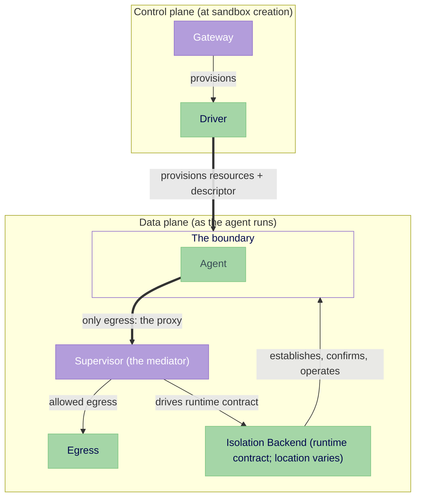

---
authors:
  - "@jganoff"
state: review
links:
  - https://github.com/NVIDIA/OpenShell/issues/1737
  - https://github.com/NVIDIA/OpenShell/pull/2048
  - https://github.com/NVIDIA/OpenShell/issues/899
  - https://github.com/NVIDIA/OpenShell/issues/981
  - https://github.com/NVIDIA/OpenShell/issues/1511
  - https://github.com/NVIDIA/OpenShell/issues/1650
  - https://github.com/NVIDIA/OpenShell/issues/1680
---

# RFC 0012 - Isolation Backend Interface

## Summary

OpenShell confines untrusted agent code with network, filesystem, syscall, and identity controls. Today the supervisor builds that boundary from the agent's container, placing isolation privilege beside the code it confines. This RFC makes the boundary a pluggable **Isolation Backend**.

The driver still provisions the sandbox. The supervisor remains the policy authority, audit source, and agent's only egress. The backend establishes and operates the boundary and supplies connection identity through one supervisor-facing contract.

That contract supports today's in-pod boundary and future sidecar, node, split-pod, and VM implementations. Each delegated placement is separate design and implementation work, not a supervisor fork.

## Motivation

Boundary construction is embedded in the supervisor, so moving it anywhere else means changing the supervisor. One inline choice creates three problems:

- A compromise reaches the boundary-building privilege in the same container.
- Restricted and multi-tenant clusters reject the deployment. Building the boundary inline needs added Linux capabilities in the agent container (seven today, including `NET_ADMIN` and `SYS_ADMIN`); the `restricted` Pod Security Standards profile those clusters require permits no added capability beyond `NET_BIND_SERVICE`, and five of the seven (`NET_ADMIN`, `SYS_ADMIN`, `SYS_PTRACE`, `SYSLOG`, `DAC_READ_SEARCH`) are off the `baseline` allowlist too, so the deployment fails `baseline` as well. (Tracked in #899.)
- Each new placement adds another branch to the supervisor.

All three come from coupling boundary construction to boundary operation. A common interface lets deployments move privilege without changing the supervisor.

## Non-goals

- **Implementing a delegated backend.** Each placement requires its own design and implementation.
- **Defining remote confirmation.** This contract requires confirmation; each cross-kernel backend defines its attestation mechanism.
- **Defining global authorization.** A separate proposal owns supervisor authorization. A delegated backend must still authenticate callers and scope them to one boundary.
- **Sharing supervisors.** This RFC keeps one supervisor per agent.

## Proposal

This RFC standardizes backend selection, lifecycle ordering, runtime interfaces, failure behavior, and invariants. How a backend constructs its boundary or transports these operations is implementation-specific.

The gateway and driver provision the sandbox on the control plane. The supervisor drives the backend while the agent runs.



The agent is contained behind the boundary; the supervisor's proxy is its only egress.

### Provisioning the boundary

Provisioning runs at sandbox creation, on the control plane, in a fixed order:

1. **Admission resolves the backend** from deployment config, not `SandboxPolicy`. Resolution fails closed; there is no downgrade.
2. **The driver provisions the compute resource** and anything the selected backend needs before the supervisor starts.
3. **The backend establishes the boundary before untrusted code runs.** This may happen during provisioning or `attach`, depending on the backend.

The driver provisions resources and sets the descriptor; the supervisor reads it and drives the contract. Each backend design owns its construction, authorization, tenant isolation, and orphan reclamation.

### The boundary descriptor

The driver sets `OPENSHELL_BOUNDARY_DESCRIPTOR` for every sandbox, including in-pod. The common, size-bounded envelope names the backend and carries an opaque attachment payload. Common code retrieves trusted requirements from the authenticated admission record, verifies the descriptor against them, and constructs `VerifiedBoundaryDescriptor`; the factory then validates payload semantics and any endpoint authentication, freshness, or replay requirements. Missing or invalid input fails closed with no default backend. The supervisor does not pass the descriptor to the workload. All drivers and the supervisor use the same versioned boundary descriptor representation.

```rust
struct BoundaryDescriptor {
    version: u32,
    backend_id: String,
    payload: Vec<u8>, // backend-specific attachment data
}

// Trusted expectations from the authenticated admission record, retained by
// VerifiedBoundaryDescriptor after common verification.
struct AdmittedBoundaryRequirements {
    backend_id: String,
    contract_version: u32,
    policy_digest: Hash,
    required_confirmation: ConfirmationKind,
    minimum_identity: Assurance,
}
```

The envelope version and backend contract version are distinct. Only common verification can construct `VerifiedBoundaryDescriptor`, which has no public constructor. An exact contract version implies support for every field of that `SandboxPolicy` version; confirmation kind and identity assurance are the only negotiated security capabilities.

Every backend confirms effective enforcement before returning `Ready`. A local backend may observe it directly; a remote backend may return verified attestation. Remote evidence is fresh, bound to the verified descriptor, authenticated claim, and admitted policy digest, and verified against a trust root outside the workload's adversary domain; its protocol remains backend-specific. Mutable enforcement remains confirmed for the boundary's lifetime, and drift fails the sandbox.

Attachment and sandbox identity binding are separate. A warm-pooled boundary is established against its admitted image baseline before a sandbox exists; `claim` later binds the sandbox, policy, agent, and resources. An incompatible claim takes the cold path. Before claim, only digest-pinned OpenShell-controlled placeholder code may run.

### The runtime contract

The boundary spans four dimensions: network, filesystem, syscall, and identity. The in-pod backend realizes them as a network namespace and routing, Landlock, seccomp, and procfs; other backends realize them differently. The contract adds no enforcement of its own; it standardizes how the supervisor drives whichever backend a deployment admits.

A backend registers a factory under a `backend_id`. The supervisor resolves the factory, attaches to the admitted boundary, and drives it through a fixed sequence of states. Each transition consumes the prior state, so the supervisor cannot skip a stage or invoke a later transition through an earlier handle. The Rust names below are illustrative; the states and their semantics are normative.

```rust
#[async_trait]
trait IsolationBackendFactory: Send + Sync {
    fn backend_id(&self) -> &str;
    fn capabilities(&self) -> BackendCapabilities;
    async fn attach(&self, descriptor: VerifiedBoundaryDescriptor)
        -> Result<Box<dyn AttachedBoundary>, BackendError>;
}

#[async_trait]
trait BoundaryControl: Send + Sync {  // retained by the supervisor after attach
    async fn wait_terminated(&self) -> Result<(), BackendError>;
    async fn shutdown(&self) -> Result<(), BackendError>; // idempotent
}

#[async_trait]
trait AttachedBoundary: Send {        // the admitted boundary; no claimed or untrusted workload
    fn control(&self) -> Arc<dyn BoundaryControl>;
    async fn claim(self: Box<Self>, claim: ClaimContext) -> Result<Box<dyn ClaimedBoundary>, BackendError>;
}
#[async_trait]
trait ClaimedBoundary: Send {         // bound to sandbox identity, policy, agent, resources
    async fn bind(self: Box<Self>) -> Result<Box<dyn BoundBoundary>, BackendError>;
}
#[async_trait]
trait BoundBoundary: Send {           // mediation interfaces connected
    fn mediation_ingress(&self) -> Arc<dyn MediationIngress>;
    fn identity_source(&self) -> Arc<dyn IdentitySource>;
    fn events(&self) -> Arc<dyn EventSource>;
    async fn confirm(self: Box<Self>) -> Result<Box<dyn ReadyBoundary>, BackendError>;
}
#[async_trait]
trait ReadyBoundary: Send {           // enforcement and mediation confirmed
    async fn start_agent(self: Box<Self>) -> Result<Box<dyn RunningBoundary>, BackendError>;
}
#[async_trait]
trait RunningBoundary: Send + Sync {  // the agent is running behind the boundary
    fn agent(&self) -> Arc<dyn BoundaryProcess>;
    fn exec(&self) -> Arc<dyn BoundaryExec>;
    fn port_forward(&self) -> Arc<dyn BoundaryPortForward>;
}

#[async_trait]
trait BoundaryProcess: Send + Sync {  // the agent, or a process started via exec
    async fn wait(&self) -> Result<BoundaryExitStatus, BackendError>; // one stable result across repeated calls
    async fn signal(&self, signal: BoundarySignal) -> Result<(), BackendError>;
    async fn terminate(&self) -> Result<(), BackendError>;            // owns the whole descendant tree
}
```

| State | Meaning | Available to the supervisor |
|---|---|---|
| **Attached** | the admitted boundary is attached; no claimed or untrusted workload | boundary control |
| **Claimed** | bound to sandbox identity, policy, agent spec, and resources | boundary control |
| **Bound** | mediation interfaces are connected | control, mediation ingress, identity, events |
| **Ready** | enforcement and mediation are confirmed | control, agent start |
| **Running** | the agent is started behind the boundary | control, retained mediation handles, agent, `exec`, `connect` |

The state order is structural: `attach` identifies the admitted boundary, `claim` introduces sandbox identity and workload requirements, only `ReadyBoundary` may start the agent, and only `RunningBoundary` exposes `exec` and `connect`. A pooled boundary may remain `Attached` until claimed. The supervisor retains `BoundaryControl` and owned runtime handles across consuming transitions.

The runtime interfaces are small and owned:

```rust
#[async_trait]
trait BoundaryExec: Send + Sync {
    async fn exec(&self, spec: ExecSpec) -> Result<ExecSession, BackendError>;
}

struct ExecSession {                              // owned; outlives the exec call
    process: Arc<dyn BoundaryProcess>,
    stdin: Option<BoundaryInput>,
    stdout: BoundaryOutput,                       // distinct from stderr for non-PTY exec
    stderr: Option<BoundaryOutput>,
    terminal: Option<Arc<dyn BoundaryTerminal>>,  // present when a PTY was requested
}

#[async_trait]
trait BoundaryPortForward: Send + Sync {
    async fn connect(&self, target: LoopbackTarget) -> Result<BoundaryDuplexStream, BackendError>;
}

trait EventSource: Send + Sync {
    fn subscribe(&self) -> Result<BoundaryEventStream, BackendError>;
}

#[async_trait]
trait MediationIngress: Send + Sync {                  // how the proxy receives connections
    async fn accept(&self) -> Result<MediatedConnection, BackendError>;
}
struct MediatedConnection {
    stream: BoundaryDuplexStream,                      // the workload connection
    flow: Flow,                                        // its identity token (see Identity)
}

#[async_trait]
trait BoundaryTerminal: Send + Sync {
    async fn resize(&self, cols: u16, rows: u16) -> Result<(), BackendError>;
}
```

`MediationIngress` is the proxy's backend-neutral source of workload connections. In-pod wraps the proxy's local listener; delegated backends use their private transport. `ExecSpec` carries command, arguments, environment, working directory, and PTY settings. Streams are owned, non-PTY stdout and stderr remain separate, and PTYs support resize. Port forwarding accepts only validated loopback targets. Event loss, exit status, and signals are explicit and placement-neutral; a local PID is never the process handle. `BoundaryControl::wait_terminated` reports boundary loss separately from agent exit.

The claim carries only the common content every backend needs:

```rust
struct ClaimContext {
    sandbox_id: SandboxId,
    policy: SandboxPolicy,        // all four dimensions
    agent: AgentSpec,
    resource_binding: ResourceBinding,
}
```

`claim` verifies these fields against the descriptor, admission record, and policy digest. A claim is authenticated, fresh, single-use, and bound to the boundary and sandbox; the backend design defines that mechanism. `ResourceBinding` is opaque, versioned driver data for the admitted cgroup, runtime security context, and devices. The agent and every `exec` descendant remain within it.

### Supervisor integration

The supervisor keeps an in-tree registry from `backend_id` to factory. Adding a backend adds an implementation and registration, not branches in the lifecycle, proxy, SSH, or session code. Delegated transports remain private to their factories.

The supervisor runs the same sequence for every backend:

1. Read and validate the descriptor envelope.
2. Match its `backend_id` to admission.
3. Resolve the registered factory and check its capabilities.
4. Attach to the boundary and retain its `BoundaryControl`.
5. Claim the sandbox identity, policy, agent spec, and resources.
6. Bind mediation ingress and identity into the proxy, and events into the orchestrator.
7. Start mediation services.
8. Confirm readiness.
9. Start the agent.
10. Enable `exec` and port forwarding.
11. Wait for the agent or `BoundaryControl` to terminate.
12. Call `BoundaryControl::shutdown`.
13. Surface the result for platform-specific cleanup.

A backend reports what it can do, so admission can reject a workload it cannot place:

```rust
enum ConfirmationKind { Direct, Attested }

struct BackendCapabilities {
    contract_version: u32,
    placement: BackendPlacement,
    confirmation: Vec<ConfirmationKind>,
    maximum_identity: Assurance,
}
```

The backend ID and exact contract version must agree across admission, descriptor, and factory. The backend must support the required confirmation kind and minimum identity assurance. Any mismatch fails closed. All other contract behavior is mandatory conformance, not a negotiable capability.

### Failure semantics

A failure is any case where the supervisor cannot obtain or apply a valid result. The contract fixes the behavior; backend-specific retry limits and transport recovery are implementation details. Every failure carries a machine-readable kind:

```rust
enum BackendErrorKind { Invalid, Denied, Unavailable, Failed, Terminated }
```

`Invalid` covers descriptor, version, backend, and capability mismatches; `Denied` covers authenticated attachment or claim rejection. The failing operation and backend diagnostics remain structured context.

| Failure | Required behavior |
|---|---|
| Missing, malformed, unsupported, or mismatched descriptor | Fail closed; never select another backend |
| Attachment denied or verification failed | Terminal for this sandbox instance |
| Boundary unavailable during attachment | Retry the same backend only; never downgrade |
| Confirmation failed | Do not start workload code; surface the failure for cleanup |
| Claim, bind, start, or runtime operation failed | Terminal; fail closed and clean up |
| Boundary terminates after start | Stop new `exec` and `connect`, and fail the sandbox |

Only `Unavailable` from `attach` is automatically retryable, always against the same backend and boundary. Mutating transitions reconcile a lost response or fail closed; they never create a second claim or agent. Failed `attach` cleans itself. After attachment, the retained `BoundaryControl` owns idempotent cleanup on every terminal path, while driver-provisioned resources remain driver-owned; backend orphan reclamation covers supervisor death. Boundary failure disables new `exec` and `connect`, drains or securely quarantines the workload, and fails the sandbox. Agent and `exec` termination cover their complete descendant trees.

### Backend invariants

Every backend satisfies these invariants:

1. **No unguarded workload egress.** Before untrusted execution and until the execution domain is drained, the workload reaches no egress but the proxy. Enforcement is effective default-deny across every protocol the platform supports, including IPv4, IPv6, raw and packet sockets, and ingress. The backend confirms behavior, not merely installed rules, and does not assume a CNI or host route provides the deny.
2. **No untrusted workload execution before `Ready`.** Workload code includes the agent image, workspace, mounts, and image-provided init code. Only digest-pinned OpenShell content may run before claim and `Ready`. Typestate enforces ordering before `Running`; calls made after dynamic termination fail closed.
3. **No unattributed workload execution.** Agent start, `exec`, and `connect` require a bound claim. A warm pool runs only its trusted placeholder before claim. Supervisor adoption removes direct launch paths that bypass the contract.
4. **Preserve the driver's execution domain.** Every workload descendant remains within the admitted cgroup, runtime security context, and device allocation carried by `ResourceBinding`. A privileged helper sees workload devices only through an admission-visible, audited authorization.
5. **No silent weakening.** A backend implements every admitted `SandboxPolicy` field across network, filesystem, syscall, and identity, or rejects the workload at admission or claim.

The invariants hold until the execution domain is drained. Landlock and seccomp are monotonic; mutable routing and firewall state stays fenced from the workload and preserves default-deny atomically. Loss of enforcement, identity, events, or backend control rejects new operations, drains or quarantines the workload, and fails the sandbox. Shared-kernel backends do not claim to contain a kernel compromise.

### Identity

The proxy calls `IdentitySource::resolve(flow)` for each connection. Admission rejects a backend below the policy's required assurance. `Unsupported` means the backend provides no identity; a per-connection `ResolveError` fails identity-scoped policy closed.

```rust
#[async_trait]
trait IdentitySource: Send + Sync {          // the proxy's per-connection resolver
    async fn resolve(&self, flow: Flow) -> Result<Identity, ResolveError>;
}

enum Identity { Evidence(Evidence), Unsupported }

struct Evidence {
    assurance: Assurance,           // ordered for policy; see below
    binary_path: PathBuf,
    binary_sha256: Option<Hash>,    // None when unavailable
    ancestors: Vec<PathBuf>,        // ancestor binaries, nearest first
    cmdline_paths: Vec<PathBuf>,    // script/interpreter paths from the cmdline
}

// Ordered for policy: binary-scoped rules require `Observed` or higher, and
// `Claimed` counts as `None` for them. `Attested` is defined narrowly (see
// below); evidence that does not meet that bar is not `Attested`.
enum Assurance { None, Claimed, Observed, Attested }
```

`Observed` means the backend identifies the process behind the accepted flow and measures its live executable; a digest is required. `Attested` preserves that flow attribution and verified live-executable digest, then adds fresh cryptographic evidence bound to the boundary and authenticated sandbox claim from a trust root outside the agent's adversary domain. Evidence below those definitions reports a lower assurance. Binary-scoped rules require `Observed` or higher; missing, ambiguous, stale, or failed resolution denies them.

`Flow` is the backend-issued, opaque token from `MediatedConnection`. The supervisor never interprets it. Procfs lookup, token construction, remote correlation, timeouts, and attestation protocols belong to backend implementations; the interface and fail-closed semantics do not change.

### Representative topologies

The security-relevant distinction is whether the supervisor shares the agent's kernel:

| Class | Kernel-compromise ceiling | Examples |
|---|---|---|
| **Shared host kernel**: supervisor and agent on the host kernel | a host-kernel exploit | in-pod, sidecar, node enforcer, `runc` split-pod |
| **Shared guest kernel**: supervisor and agent share one isolated kernel, a VM guest kernel or a userspace application kernel such as gVisor's; the host is isolated, the supervisor is not | a guest-kernel exploit | single-pod microVM, outer gVisor sandbox |
| **Kernel-separated**: supervisor outside the agent's guest kernel | escaping the agent's guest kernel | split-pod with the agent under a VM or gVisor `runtimeClassName`, future node runtime |

The first two classes do not contain a kernel-level adversary; sidecar, node, and split-pod placements may still add privilege separation within that ceiling. A single-pod VM or gVisor RuntimeClass places the supervisor inside the agent's guest or application kernel; kernel separation requires the supervisor outside it. In every class, the trusted computing base includes the supervisor, backend, and their control channel.

The non-normative [selection matrix](./topology-matrix.md) compares concrete placements.

## Implementation plan

Backends arrive incrementally behind one contract:

1. **Land the contract and in-pod adapter.** Add the registry and explicit descriptors behind a rollout gate; preserve current behavior.
2. **Close the in-pod release gates.** Repair egress confirmation and the trusted-init window, then route the supervisor through the adapter and enable it.
3. **Add a sidecar backend (separate design).** Move network-setup privilege out of the agent container; on Kubernetes, map `boundary_ready` to a native sidecar `startupProbe` so agent startup waits for the boundary and closes the `workspace-init` window where sidecar containers are available.
4. **Add a node or split-pod backend (separate design).** Validate establishment outside the supervisor.
5. **Add kernel-separated backends as demand warrants (separate designs).** Each defines its attestation and cross-kernel identity.

Drivers emit explicit in-pod descriptors before the supervisor requires them; there is no implicit default. RFC acceptance approves the contract, not the follow-on backends. The RFC becomes `implemented` when the in-pod backend passes its release gates and runs through the contract.

Shared conformance tests cover version agreement, lifecycle ordering, process semantics, confirmation, identity failure, execution-domain preservation, cleanup, and boundary termination.

## Risks

- **In-pod confirmation is incomplete.** Its nftables ceiling is accept-by-default, covers only TCP and UDP, and disappears when `nft` is absent. Step 2 must establish and confirm effective default-deny before release.
- **Runtime endpoints bypass containment.** Admission must positively constrain reachable runtime endpoints, host namespaces, paths, and devices.
- **The init path runs too early.** `workspace-init` executes image-provided code before egress confinement. The in-pod backend cannot ship until this path uses trusted content or runs behind an established boundary.
- **Contract conformance does not create containment.** Each delegated backend must prove that enforcement and its control channel are outside the workload's reach.
- **Cross-kernel identity is unproven.** Remote correlation is on the connection hot path; timeout or lookup failure denies identity-scoped egress.
- **Adoption spans several entry paths.** Agent launch, SSH, and supervisor sessions must all move behind the contract without changing behavior.

## Alternatives

### Implement a specific topology directly, without the interface

OpenShell could wire one delegated topology (the split-pod proposal in #981, for example) straight into the supervisor and the driver.

This solves one placement but hardwires it. The factory, states, and registry cost less than a supervisor fork for each later placement. Backend transports, `Flow` formats, and attestation remain follow-on design work.

### Fold boundary operation into the compute driver

Establishing the boundary is already a driver concern, so the runtime side could live there too.

The driver provisions platform resources; the supervisor operates policy, identity, and runtime lifecycle. Putting runtime operations in compute drivers would duplicate the supervisor-facing contract across them.

### Select the backend through `SandboxPolicy`

The backend could be chosen by the workload's `SandboxPolicy` alongside its other isolation settings.

`SandboxPolicy` is workload policy; which backend realizes it is deployment topology. Coupling them would let an untrusted workload influence its own isolation strength and make policy non-portable across deployments, which is why selection sits in admission config instead (see Provisioning the boundary).

### Relax pod semantics to give containers different isolation classes

A single pod could place its containers in different kernels, so the supervisor and agent share a pod but not a kernel.

The kernel boundary is selected per pod (`runtimeClassName`), not per container, so this needs a CRI change and a runtime that acts on it, not a backend behind this interface. The supported ways to separate the supervisor's kernel from the agent's are two pods or a future node runtime.

### Fold this into the proxy egress work (#1511)

This boundary could be part of #1511, which scopes the proxy pipeline.

The proxy egress work (#1511) owns the proxy above the boundary. This RFC defines the boundary beneath it, the thing that forces traffic into the proxy. The two are adjacent but distinct concerns.

## Prior art

- **Driver-backed subsystems (CRI/CNI/CSI).** Kubernetes factors runtime, networking, and storage into pluggable driver contracts so the orchestrator drives one interface while implementations vary. RFC 0001 describes OpenShell's other subsystems the same way; this fills in the one it left as a box.
- **Istio privilege placement.** Init-sidecar and node-agent modes demonstrate that network setup can move without changing the policy data path. OpenShell keeps its identity-aware proxy.
- **CRI exec/attach/port-forward.** `exec` and `connect` follow CRI's `Exec` and `PortForward` shape; lifecycle and mediation remain OpenShell-specific.

## Appendix: in-pod migration sketch

The in-pod adapter preserves behavior and privilege while moving existing code behind the states. `attach` creates or joins a closed, unclaimed boundary and returns its control handle; a pooled boundary retains its admitted baseline. `claim` binds the sandbox and policy; `bind` returns mediation, identity, and events; `confirm` checks effective enforcement; and `start_agent` returns `RunningBoundary`. Existing process launch, `exec`, and `connect` paths move behind their runtime interfaces. `BoundaryControl` owns termination and cleanup.

## Appendix: designing a backend

A backend-specific design covers its ID and factory, descriptor payload and verification, lifecycle transitions, runtime interfaces, confirmation, policy and resource preservation, provisioning, cleanup, termination, and conformance tests.

## Appendix: codebase grounding

The claims this RFC makes about the current system are verified, with file:line
references, in the supporting file [codebase-grounding.md](./codebase-grounding.md)
(against `origin/main` at commit `a5161d0`, the RFC's parent).
