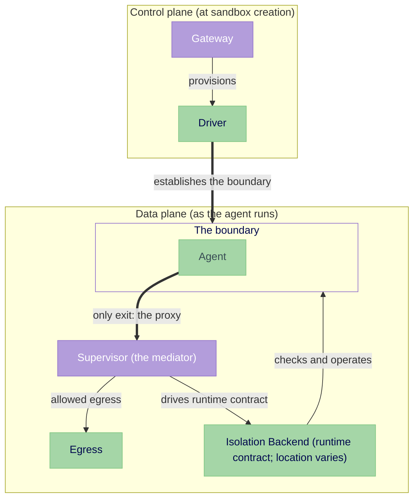
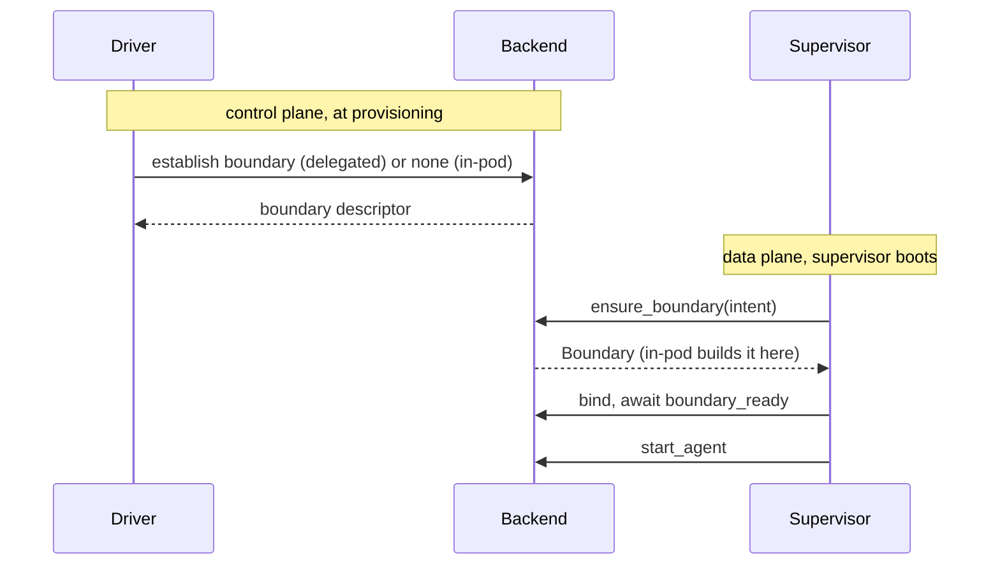

---
authors:
  - "@jganoff"
state: draft
links:
  - https://github.com/NVIDIA/OpenShell/issues/1737
  - https://github.com/NVIDIA/OpenShell/issues/899
  - https://github.com/NVIDIA/OpenShell/issues/981
  - https://github.com/NVIDIA/OpenShell/issues/1511
  - https://github.com/NVIDIA/OpenShell/issues/1650
  - https://github.com/NVIDIA/OpenShell/issues/1680
---

# RFC 0012 - Isolation Backend interface

## Summary

RFC 0001 names the component that owns an agent's isolation boundary the **Isolation Backend** and draws it beside the supervisor, but leaves it unspecified. Today the supervisor builds the boundary itself, inline, with logic hardcoded for one placement, so every other placement forks the supervisor.

This RFC specifies the Isolation Backend: a pluggable component that establishes and enforces the boundary, while the supervisor operates it as the policy authority (proxy, policy, identity, audit). The interface is one runtime contract the supervisor drives. Because the supervisor's calls are identical wherever the boundary sits, it runs unchanged across placements.

OpenShell is already building placements other than in-pod, a microVM driver and an outer gVisor sandbox among them. Without one contract, each wires its own privileged setup into the supervisor. The interface makes those placements backends behind a single contract, and keeps open the path to running the supervisor outside the agent's kernel.

The boundary covers the full isolation envelope, all of which the supervisor already enforces today: network, filesystem (Landlock), syscall (seccomp), and identity. This RFC works the contract out against the network dimension, where the privilege cost is most pressing and the runtime mediation richest; the same contract carries the other three. It does not solve control-plane authorization.

## Motivation

An agent runs untrusted code, so OpenShell confines it behind an isolation boundary: the constraints that control what the agent can reach and what can reach it. Building that boundary takes privilege, and today the supervisor builds it itself, from inside the agent's own container. So the privilege that constructs the cage sits inside the cage, next to the code it is meant to contain.

That privilege is stuck there because building the boundary is written into the supervisor. The boundary could sit elsewhere instead, in a separate pod, a microVM, an outer gVisor sandbox, but each of those means changing the supervisor. One inline choice creates problems across the board:

- Restricted and multi-tenant clusters reject the deployment. Building the boundary inline needs seven Linux capabilities in the agent container, so it cannot run under the `restricted` Pod Security Standards profile that those clusters require. (Tracked in #899.)
- The privilege that builds the boundary sits in the same container as the untrusted workload, so a compromise reaches the very setup meant to contain it.
- Each new placement forks the supervisor. The microVM driver and the outer gVisor sandbox each wire their own privileged setup into the supervisor, and it accretes a branch per placement.

The boundary is built inline, so all three trace to the same coupling: building the boundary and operating it are the same code. Separating them lets the privileged build move out of the agent's container, and lets a new placement be a new backend instead of another branch in the supervisor.

## Non-goals

- **The mechanism for confirming a boundary the supervisor cannot observe.** Containment is structural (see How it fits together); a backend confirms the boundary where it can. How a backend confirms one the supervisor cannot directly read (an attested statement of the established config) is a backend concern, not designed here.
- **Control-plane authorization.** The supervisor authenticates to the control plane today, but nothing scopes what an authenticated supervisor may do to its own sandbox. A separate proposal owns that scoping. This RFC defines the boundary and identity it would operate on, so it does not block on it.
- **One-to-N supervisors.** This RFC keeps one supervisor per agent; sharing a supervisor across sandboxes is deferred (see Plan).

## Proposal

Make the boundary a pluggable component the supervisor drives. We call it the **Isolation Backend**. The backend establishes and enforces the boundary; the supervisor operates it as the policy authority (proxy, policy, identity, audit). Moving the privileged establish-and-enforce work into the backend is what lets the agent container shed its isolation privilege.

The supervisor talks to the backend through one runtime contract: a small set of calls to bring the boundary up, start the agent inside it, mediate it, and tear it down. Those calls are identical wherever the boundary sits, which is what lets one supervisor run unchanged across placements. A deployment chooses the placement, in the agent's own container or further out; the supervisor's calls do not change.

Two components already bracket the backend, one on each side of the sandbox's life. The driver, at the control plane, provisions the sandbox's resources when it is created and tears them down when it ends. The supervisor, at the data plane, runs inside the sandbox and operates the boundary while the agent runs. The backend is the boundary between them: the driver gets it in place as part of provisioning, and the supervisor operates it through the runtime contract. The driver sets it up, the supervisor runs it, and the runtime contract is the only interface between the supervisor and the backend.

The contract does not cover how a backend establishes its boundary, because that is where placements genuinely differ. Each backend settles its own establishment in the RFC that introduces it.

### The isolation envelope

The boundary spans the full envelope: network (netns and routing), filesystem (Landlock), syscall (seccomp), and process identity (procfs). The supervisor already establishes all four inline today; the interface puts a contract around them, it does not add them.

The contract holds all four by *shape*, not by enumerating each. Every dimension is *established* by the backend, and some are also *operated* by the supervisor at runtime: the proxy mediates network, the `identity` call exposes identity. Filesystem and syscall are established once before the agent starts and need no runtime call, which the contract allows; a dimension the supervisor only establishes, never operates, is fine.

This RFC works the contract out against the network dimension, the one with the richest runtime mediation and the most pressing privilege cost. The other three are established the same way. Whether the contract absorbs each dimension's specifics without changing shape is the test of this RFC.

### How it fits together

When the driver establishes the boundary ahead of the supervisor (the delegated case), it leaves a **boundary descriptor** the supervisor reads at `ensure_boundary`. The descriptor names how the supervisor attaches to the boundary, whatever the boundary is. It is bound to the admitted sandbox and integrity-protected, so the supervisor attaches to the boundary admission selected for *this* sandbox and cannot be pointed at a forged one. For the in-pod backend there is no handoff: `ensure_boundary` builds the boundary in the same process that operates it.

The supervisor does not re-check the boundary's contents; a backend may build it where the supervisor cannot read. Where a backend *can* expose it, the supervisor SHOULD confirm before the agent runs and fail closed if confirmation fails. It is a SHOULD, not a MUST, because some backends cannot expose their internal state across a kernel boundary, and structural enforcement carries those cases. A backend whose boundary can change after startup SHOULD monitor for drift and fail the sandbox on it.

A delegated backend's establishment is its own design, settled in the RFC that introduces it. The consequence is named, not hidden: a delegated backend's hardest, most security-critical work lives outside this interface. For a node daemon serving many sandboxes, that work includes admitting requests, isolating one sandbox's boundary from another, and reclaiming a boundary whose supervisor died (see Open questions).



The supervisor straddles the boundary: the agent is contained inside, and the supervisor's proxy is its only exit.

Backend selection is deployment and admission config, not `SandboxPolicy`: admission resolves it, fails closed if the backend cannot be realized, and forbids silent downgrade, so a workload cannot pick weaker isolation for itself.

### Provisioning sequence

The driver and supervisor coordinate through what provisioning leaves behind, not by calling each other. The driver provisions resources and (for a delegated backend) establishes the boundary, leaving the descriptor. The supervisor boots, reads the descriptor at `ensure_boundary`, and drives the contract from there. Any driver and any backend plug in at the same two points: the driver produces a descriptor, the supervisor consumes it.



Identity can bind late, and the contract keeps two things separate that warm pooling pulls apart. *Boundary attachment* is what `ensure_boundary` and the descriptor settle: how the supervisor attaches to the boundary. *Identity binding* is which sandbox this is, the `sandbox_id`. They are different exchanges and the descriptor carries only the first.

A warm-pooled pod is created before any sandbox exists (#1892). Its boundary is established at boot against the image's baseline policy, identity-free, before any claim. The supervisor learns its `sandbox_id` later, when a claim binds, through a separate control-plane handoff: in the Kubernetes flow it presents its projected ServiceAccount token to the gateway, which re-anchors it through the pod's owning records and mints the sandbox JWT. That handoff is local while the supervisor shares the pod, and it is the exchange that must cross the boundary when the supervisor is delegated. Because the baseline policy is fixed at boot, a workload needing a custom policy cannot be served from the pool; it takes the cold path.

A pooled boundary is established but unclaimed, never a running agent without a sandbox: `start_agent` runs only after a claim binds the identity. This is a third readiness condition warm pooling adds to the second invariant, identity bound, alongside the boundary being ready.

### The runtime contract

The contract is one interface. Every backend implements it: the in-pod backend does the work in-process; a delegated backend implements the same methods as a client to a boundary that lives elsewhere. The return types are handles, defined so they carry across a process boundary, which is what makes the delegated implementation possible. The supervisor calls the interface and does not branch on which backend answers. The signatures below are the in-pod shape; a delegated backend's calls are all remote, so it implements them async.

```rust
trait IsolationBackend {
    // Lifecycle. Called in order; nothing runs inside the boundary until it is ready.
    fn ensure_boundary(&self, intent: Intent) -> Result<Boundary>; // confirm where possible; fail closed
    fn bind(&self, boundary: &Boundary) -> Result<Attachment>;     // proxy address, identity source, events
    async fn boundary_ready(&self, a: &Attachment) -> Result<()>;  // rules installed AND proxy listening
    fn start_agent(&self, a: &Attachment) -> Result<AgentHandle>;  // no spec: the Boundary carries it
    fn events(&self, a: &Attachment) -> Stream<Event>;             // denials, attributions, bypass, failures

    // In-boundary. Valid only after the agent has started.
    fn exec(&self, a: &Attachment, spec: ProcessSpec) -> Result<Process>;
    fn port_forward(&self, a: &Attachment, target: Target) -> Result<Stream>;
    fn identity(&self, a: &Attachment, flow: Flow) -> Identity; // Evidence or Unsupported

    fn metadata(&self) -> BackendMetadata; // placement, for audit only; not on the handles
}
```

The call order is a security property: the supervisor runs `ensure_boundary`, `bind`, and waits for `boundary_ready` before `start_agent`, so the agent's workload cannot run before the boundary confines it. The implementing RFC enforces the order so it cannot be skipped.

`metadata` is the one method that exposes placement, and it feeds audit only. Policy *decisions* never read it, so the decision logic stays identical across placements. If a stronger boundary forces the policy layer to learn something stack-specific, the interface has leaked. The proxy's failure handling does vary: when `identity` is a remote call into a guest, it can be slow or fail, and the proxy fails closed (no identity, deny the binary-scoped rule), so a kernel-separated placement needs timeout and fallback handling an in-pod one does not.

A few calls carry detail the signatures do not:

- Today's K8s entrypoint is `sleep infinity` and the agent's real work enters through `exec` (over SSH), so the untrusted workload arrives via `exec`, not `start_agent`. The contract treats both the same: every spawned process, entrypoint or `exec`, passes through one pre-exec ceiling that applies `drop_privileges`, seccomp, and Landlock, so the boundary confines it regardless of which call started it. `start_agent` marks the point after which in-boundary calls are valid, not where the untrusted code necessarily is. Per-`exec` policy *evaluation* (beyond that static ceiling) does not exist today; whether to add it is an open question, live precisely because `exec` is the primary workload entry.
- `port_forward` is scoped to loopback targets today (a VM has its own `localhost` the supervisor cannot reach otherwise). Broadening it needs an explicit egress policy check, since a backend that opens connections on request is an egress bypass unless policy decides each one.
- `exec` and `port_forward` mirror CRI `Exec` and `PortForward`. There is no teardown call: in-pod the netns drops on exit, and delegated, the driver tears down resources via `StopSandbox`/`DeleteSandbox`; a delegated boundary that fails early surfaces as a `BoundaryTerminated` event.

### Two invariants every backend must hold

These define what it means to be a backend; a backend that cannot hold both is not valid.

1. **No unguarded workload egress before ready.** The agent's workload reaches no egress but the proxy before the boundary is established, either by holding its start or by installing a deny-all ceiling first. A backend must *enforce, or confirm enforcement of*, the deny rather than assume the platform provides it (a NetworkPolicy is inert without an enforcing CNI; the in-pod case holds only while the host does not forward the sandbox subnet). The in-pod backend does not satisfy this today (a known gap, see Risks) and does not ship until it does.
2. **No execution before ready, and none before identity is bound.** No workload process runs inside the boundary until the boundary is ready *and* the sandbox identity is bound. `start_agent` is the first call that may run one, and `exec` and `port_forward` are valid only after it, so neither the entrypoint nor an `exec`'d process (the primary workload path today) can execute before the boundary confines it. The identity clause is what makes a warm-pooled pod safe: it can hold a ready boundary with no claim, but it cannot run the agent until a claim binds (see How it fits together). Both invariants are scoped to the agent *workload*; provisioning-plane steps (Kubernetes init containers) are outside them (see Risks).

Both invariants hold against application-level escapes, not kernel-level ones: in a shared-kernel placement a kernel exploit reaches the enforcement itself (see Representative topologies on how far enforcement sits from the agent). The invariants are about what a *contained* agent cannot do, not about surviving a kernel compromise.

### Identity

`identity(flow)` answers who is behind a connection, so policy can scope rules to a binary. It is capability-gated: a backend that cannot provide identity returns `Unsupported`, and admission rejects any policy that needs a level the backend cannot meet.

```rust
enum Identity { Evidence(Evidence), Unsupported }

struct Evidence {
    assurance: Assurance,    // how trustworthy the rest is
    binary_path: String,
    binary_sha256: Hash,
    ancestors: Vec<Process>,
    cmdline_paths: Vec<String>,
}

// Weakest to strongest. Binary-scoped rules require `Observed` or higher;
// `Claimed` is treated as `None` for them, so an unverified identity
// cannot satisfy a binary-scoped rule.
enum Assurance { None, Claimed, Observed, Attested }
```

`Observed` is the supervisor reading and hashing the binary itself, which the in-pod backend does via procfs; `Attested` is a cryptographic statement from across a boundary the supervisor cannot read. The `Evidence` schema is stable, so the source can change (procfs today, attestation later) without touching the policy layer.

The `flow` argument is an opaque per-connection reference the backend issues and resolves to the owning process; the supervisor never interprets it. A backend that first carries identity across a kernel boundary defines its own flow format, including who may forge a reference.

### Representative topologies

No single placement is universal. Infrastructure and workload determine the choice, and a deployment selects the one that matches its threat model. Most placements built or in flight co-locate the supervisor with the agent. Kernel separation is reachable two ways: a separate supervisor pod with the agent pod under a VM or gVisor `runtimeClassName` (buildable on stock Kubernetes today), or a future node runtime that runs the supervisor outside the agent's kernel without a per-agent guest. The interface covers all of them.

| Placement | Status | Supervisor vs. agent kernel |
|---|---|---|
| In-pod (today-hardened) | built; non-root hardening planned | shared (host) |
| microVM | built (`openshell-driver-vm` on `main`) | shared (guest) |
| Node enforcer | in flight (open PR) | shared (host) |
| Outer sandbox (gVisor) | in flight (open PR) | shared (guest) |
| Sidecar | planned | shared (host) |
| Split-pod, `runc` agent | not built | shared (host) |
| Split-pod, VM or gVisor agent | not built; expressible today | separated (guest) |
| Future node runtime | not built | separated |

Containment strength follows from that kernel relationship: the further the boundary sits from the agent's kernel, the more a compromised agent must break to reach the enforcement that confines it.

| Placement | A compromise that reaches enforcement |
|---|---|
| In-pod (shared kernel) | a kernel exploit |
| Node component, sidecar, or `runc` split-pod (shared host kernel) | a host-kernel exploit |
| Supervisor outside the agent's guest kernel (split-pod with a VM or gVisor agent, or a future node runtime) | nothing short of escaping the guest kernel |

Reaching the last row depends on *where the supervisor runs*, not just on the RuntimeClass. A VM or gVisor RuntimeClass on a single pod isolates that pod from the host but boots the supervisor *inside* the agent's guest, so it does not reach the last row. The same RuntimeClass on the agent pod with the supervisor in a *separate* pod does: the agent gets its own guest kernel and the supervisor sits outside it. Kernel separation is the product of two independent choices, the agent's RuntimeClass and the supervisor's pod, not of either alone. A deployment chooses the placement; the supervisor's policy layer is the same for all.

The supervisor is in the trusted computing base: it is the proxy, reads identity, and emits audit, so a compromised supervisor is a compromised boundary. In a shared-kernel placement it sits in the agent's blast radius; moving it to its own kernel is what removes it. The in-pod floor is privilege separation, not isolation from a kernel-level adversary; a kernel-separated placement is what raises that floor.

A [selection matrix](./topology-matrix.md) maps a deployment's starting point to a recommendation. The design logic for *why* the set is what it is follows. Two axes set the space: whether the supervisor shares the agent's kernel, and the pod count / plug point. One combination is impossible on stock Kubernetes.

| | Supervisor shares the agent's kernel (host or guest) | Supervisor in its own kernel, separate from the agent |
|---|---|---|
| One pod | Today-hardened, Sidecar proxy. Per-container `securityContext` varies privilege; the proxy mediates within the pod netns. | **Not expressible on stock Kubernetes.** The runtime that owns the kernel boundary is selected per pod (`runtimeClassName`), not per container, so two containers of one pod cannot have different kernels. |
| Two pods / node runtime | Node enforcer, or a `runc` split-pod: both share the host kernel. A single-pod outer sandbox (gVisor, Kata, or Firecracker) isolates the *host* but boots the supervisor *inside* the guest, so it shares the agent's *guest* kernel. | Split-pod with the agent pod under a VM or gVisor `runtimeClassName` (the supervisor stays in its own pod, outside the agent's guest), or a future node runtime that runs the supervisor outside the agent's kernel. |

The forbidden cell holds because of the CRI shape: the kubelet calls `RunPodSandbox` with the runtime handler once, per pod, then `CreateContainer` inside that one sandbox. The handler, and so the kernel, is fixed per sandbox; selecting it per container would need a new per-container CRI field plus a runtime that acts on it, not just a different backend behind this interface. The right column costs more (the supervisor can no longer read `/proc` or enter the netns directly, so those reach-ins route through the backend) and only the node enforcer or split-pod reaches a fully unprivileged *pod*; the [topology matrix](./topology-matrix.md) covers the capability-by-capability staging.

## Plan

Backends arrive incrementally behind one contract, behavior-preserving first. The supervisor's runtime calls do not change between steps; only the backend behind them does.

1. **Extract the in-pod backend.** Define the runtime contract as a Rust trait and put today's in-pod path behind it, unchanged in behavior, privileges, and startup order, validated by the existing test suite. This proves the contract on a real backend before any privilege moves.
2. **Confirm the in-pod boundary.** Make the in-pod backend satisfy the no-unguarded-egress invariant by confirming its own boundary before it reports ready (it does not today; see Risks). The in-pod backend ships only once it does.
3. **Move the privilege off the agent container.** Deliver the sidecar placement, which drops `NET_ADMIN` from the agent container, then the node enforcer or split-pod, which drops it from the *pod* (an unprivileged, `restricted`-compatible pod). This is the first real privilege reduction.
4. **Specify delegated confirmation (separate design).** Define how a backend confirms a boundary the supervisor cannot read, the runtime-endpoint binding to the admitted sandbox, and drift handling. Required before any kernel-separated backend ships.
5. **Add stronger backends.** microVM, outer gVisor, a future node runtime that runs the supervisor outside the agent's kernel, prioritized by demand.

Two scope choices shape the sequence. The supervisor stays 1:1 with the agent; sharing one supervisor across many sandboxes is deferred until the identity and authorization model exists (it needs per-sandbox network binding and workload identity that do not exist yet). This is about the supervisor, not the backend: a node-level backend serves many sandboxes on its node, and that is expected. And a backend is introduced as config, validated by admission, defaulting to in-pod, so each step lands without a breaking change. A shared, backend-agnostic conformance check (lifecycle ordering, fail-closed on a missing boundary, readiness) is the contract every backend implements against.

## Risks

- **The refactor spans several entry paths.** Moving namespace plumbing out of the supervisor's call sites (agent launch, SSH, supervisor sessions) and behind the runtime contract is real work, and the in-pod backend must come out behaviorally identical with the existing tests intact.
- **Init-container exposure, and which topologies close it.** A `workspace-init` step runs the agent's own image as root, *after* the pod netns exists but *before* the supervisor's in-pod egress confinement (its routing and nftables rules) is installed, so it has unmediated egress in that window. (A CNI-enforced deny-all NetworkPolicy, where present, *is* active during init and closes the window, which is why it is one of the mitigations below.) The init-container pattern is a deployment choice of the Kubernetes driver, not a requirement of this interface: the interface requires only that the boundary exists before `start_agent`. Same-pod topologies cannot close the window (confinement is built by a later container); topologies that provision the boundary before the pod's containers run (a pod-gated delegated backend, or a node runtime) can. For same-pod topologies, deployments SHOULD replace the agent-image init container with a fixed, auditable trusted seed image, or apply a deny-all-egress NetworkPolicy before any init container runs. It is a named, tracked residual risk with deployment-level mitigations, not an interface change.
- **The daemon socket is a container escape independent of the boundary.** For any container-based backend, admission must reject a sandbox spec that mounts the container runtime daemon socket (`/var/run/docker.sock` or the Podman equivalent) into the agent container: access to it is a full container escape regardless of how tight the network boundary is. A correct network boundary around a container that can still reach the daemon socket is not a contained sandbox.
- **Delegated is new backend work, not a refactor.** Every delegated topology here (cross-pod gate release, handle proxying, the runtime endpoint, drift monitoring) is new construction a future backend must deliver and *prove*. Stating requirements is not meeting them.
- **The in-pod boundary is not self-confirming today.** Its egress confinement holds only while the host does not forward the sandbox subnet, and its nftables backstop silently disappears when `nft` is absent (`install_bypass_rules` returns `Ok`). Closing this (fail closed when `nft` is absent, confirm host-forwarding at startup) is the work behind step 2 of the plan; the in-pod backend does not ship until it does.
- **A delegated backend's containment depends on its placement, not on this interface alone.** The interface provides the call sites and the structural-containment requirement; a delegated backend earns its containment by where it puts the enforcement. A backend that satisfies the contract but places enforcement where the agent can reach it is not contained.

## Alternatives

### Implement a specific topology directly, without the interface

OpenShell could wire one delegated topology (the split-pod proposal in #981, for example) straight into the supervisor and the driver.

This solves one placement but hardwires it. The next topology (a node runtime, a VM) forks the supervisor again, and the supervisor accretes placement-specific branches. The interface lets each topology land behind the same runtime contract, so the supervisor does not change as placements are added.

### Fold boundary operation into the compute driver

Establishing the boundary is already a driver concern, so the runtime side could live there too.

Establishing and operating the boundary are different jobs. The driver provisions platform resources and stands up the boundary; operating it (proxying, policy, identity, the lifecycle the supervisor drives) is the supervisor's runtime concern, not the driver's. Keeping the runtime contract separate lets one supervisor-facing interface be satisfied across every driver and backend, rather than each driver reimplementing it.

### Select the backend through `SandboxPolicy`

The backend could be chosen by the workload's `SandboxPolicy` alongside its other isolation settings.

`SandboxPolicy` is workload policy; which backend realizes it is deployment topology. Coupling them would let an untrusted workload influence its own isolation strength and make policy non-portable across deployments, which is why selection sits in admission config instead (see How it fits together).

### Relax pod semantics to give containers different isolation classes

A single pod could place its containers in different kernels, so the supervisor and agent share a pod but not a kernel.

The kernel boundary is selected per pod (`runtimeClassName`), not per container (see the forbidden cell), so this needs a CRI change and a runtime that acts on it, not a backend behind this interface. The supported ways to separate the supervisor's kernel from the agent's are two pods or a future node runtime.

### Fold this into the proxy egress work (#1511)

This boundary could be part of #1511, which scopes the proxy pipeline.

The proxy egress work (#1511) owns the proxy *above* the boundary. This is the boundary *beneath* it, the thing that forces traffic into the proxy. They are adjacent but distinct concerns.

Not doing any of this leaves the boundary inline in the supervisor. Its privilege stays in the agent's container, so OpenShell stays blocked from restricted Pod Security (#899) and keeps the privileged setup in a compromise's reach (#981), and each new topology forks the supervisor again.

## Prior art

- **Driver-backed subsystems (CRI/CNI/CSI).** Kubernetes factors runtime, networking, and storage into pluggable driver contracts so the orchestrator drives one interface while implementations vary. RFC 0001 describes OpenShell's other subsystems the same way; this fills in the one it left as a box.
- **istio's privilege placement.** istio reduces transparent-proxy deployment to a placement choice: `istio-init` holds `NET_ADMIN`/`NET_RAW` then exits, leaving an unprivileged Envoy sidecar (the analog of our sidecar placement); ambient mode runs a per-node `ztunnel` daemon with no per-pod sidecar (the analog of our node-enforcer placement). We borrow the *placement* options, not the enforcement data path: OpenShell mediates through its own identity-aware proxy, not an iptables redirect.
- **CRI exec/attach/port-forward.** `exec` and `port_forward` mirror CRI's `Exec` and `PortForward`; a future stdio attach would mirror CRI `Attach`. The gateway already speaks this shape (`ExecSandbox`, `CreateSshSession`, `ForwardTcp`). Whether to align with CRI is an open question, since CRI is pod/container-shaped and does not model the two-plane split or the mediation attachment.

## Open questions

These ask for direction; they do not reopen whether the interface should exist. The implementing RFC works out the wire-level detail (error taxonomy, the `AgentHandle` wire form, the agent-spec and restart lifecycle, a possible stdio-attach call); the questions below are the ones the project should weigh in on now.

- Is the call surface right, and should it align with CRI (which already models exec/attach/port-forward and a sandbox lifecycle) rather than be bespoke?
- Backend selection is deployment and admission config. A deployment may run a low-risk agent and an arbitrary-code agent that need *different* backends. Should selection be expressible per workload in admission policy, and is that a seam to add now or later?
- `events` carries both security events (denials, bypass) and a lifecycle event (`BoundaryTerminated`). Should they be one stream or two?
- `exec` and `port_forward` are specific cases of a typed bidirectional channel between the supervisor and the boundary. Should a later revision unify them under a generic channel primitive, so a node-level backend that needs other channel types does not special-case each one?
- A future node-level backend may authorize per-operation capability grants at admission (the supervisor presents a grant, the backend enforces it). The model does not prescribe this but should not foreclose it: should the interface carry a per-call authorization context?
- Confirmation is a SHOULD (see How it fits together). For backends that cannot expose it, is structural enforcement sufficient, or should some confirmation be required before a backend is used with high-sensitivity workloads?
- A multi-tenant backend (a node daemon serving many sandboxes) must refuse to let one sandbox's supervisor operate another's boundary. The boundary descriptor gives the supervisor authenticity (it attaches to the boundary admitted for *this* sandbox); the converse, the daemon authenticating which supervisor may drive which boundary, is the daemon's own security property. Should this RFC state tenant isolation as a requirement on any 1:N backend, even though the mechanism is the backend's to design?
- A delegated boundary outlives a crash: a node daemon holding privileged netns rules for a sandbox whose supervisor died, with the driver unaware, leaks privileged state. Does a 1:N backend need a lease or heartbeat so it can reclaim an orphaned boundary, and should the contract carry the liveness signal or leave it to the backend?
- Identity across a kernel boundary is not only a format question. When `identity` is a synchronous call into a guest, an inbound proxy connection must acquire its flow cheaply, and a slow or failed lookup fails closed to deny-all egress. Whether a cheap correlation path exists is what decides if a kernel-separated backend can do binary-scoped policy at all; is it feasible, and at what hot-path cost?
- This RFC details the network dimension. Does the contract shape hold for filesystem, syscall, and identity as stated, and should it live under #1511, as its own RFC, or elsewhere?

Two follow-ups are owned by other work and the interface does not depend on either. **Control-plane authorization** (what an authenticated supervisor may do is unscoped) is a prerequisite *for* an authz system, not blocked by it: this interface defines the boundary and identity an authz system would operate on. **uid/gid mapping** (whether the sandbox process uid/gid matches the pod security-context uid) is good hygiene regardless of topology and progresses independently.

## Appendix: in-pod migration sketch

Behavior is identical to today; only the placement of boundary setup and process entry changes. `ProcessHandle::spawn` already separates the spec from the boundary handle (it takes `netns: Option<&NetworkNamespace>`), so this is `exec(attachment, spec)` in embryo. The refactor: `ensure_boundary` builds the netns in the agent's container (still privileged there; no capabilities removed); `bind` returns the proxy address, identity source, and event stream; on `boundary_ready` the supervisor brings up its proxy and exec/session paths, then `start_agent` forks the entrypoint into the netns; `exec` and `port_forward` move from direct namespace plumbing to runtime calls. Teardown stays automatic. The self-confirmation step (read the boundary back, fail closed if `nft` is absent) lands with it.

## Appendix: designing a backend

A backend author starts from the containment property they want, decides where enforcement sits to get it, and the contract calls follow:

1. **Pick the property.** What must the agent be unable to do, and what must stay protected from it. "Egress only through the proxy" is the network property; "the agent cannot reach the supervisor's kernel" is a stronger one.
2. **Place the enforcement below the agent's reach.** That placement *is* the containment. In-pod puts it in the agent's netns; a node enforcer puts it on the node; a VM puts it in the hypervisor. The further out, the stronger the property and the more the supervisor's reach-ins must travel through the contract.
3. **Establish it, then operate it.** Establish that enforcement before the supervisor runs (inline for in-pod, via the driver for delegated); answer the runtime contract's lifecycle and in-boundary calls.

Worked example, a node enforcer that drops `NET_ADMIN` from the agent pod:

- *Property:* egress only through the proxy, with no isolation privilege in the agent pod.
- *Placement:* a privileged per-node daemon installs the netns routing and rules from the node, so the pod needs no capability. The supervisor stays in the pod (it still shares the host kernel; this placement does not separate kernels).
- *Establishment:* the supervisor's `ensure_boundary` call reaches the daemon (this is the in-pod supervisor registering with the node daemon, expressed *as* `ensure_boundary`, not a side protocol). The daemon enters the agent pod's netns, installs the routing and rules, confirms them (it can read back what it installed), and returns the confirmed attachment. The supervisor holds no privilege in this exchange; the daemon does the privileged work and answers the call.
- *Runtime:* `bind`, `boundary_ready`, `start_agent` proceed as in-pod. Because the supervisor still shares the agent's kernel, `exec`/`port_forward`/`identity` use it directly, unchanged from in-pod.

A kernel-separated backend (a split-pod with the agent under a VM or gVisor RuntimeClass, or a node runtime that puts the supervisor outside the agent's kernel) follows the same loop with a stronger step 2: the in-boundary calls now route over the backend's guest channel and the backend supplies identity evidence the supervisor cannot gather itself. The lifecycle calls and the supervisor's mediation are unchanged.

## Appendix: codebase grounding

The claims this RFC makes about the current system are verified, with file:line
references, in the supporting file [codebase-grounding.md](./codebase-grounding.md)
(against `origin/main` at commit `4ee27d99`).
