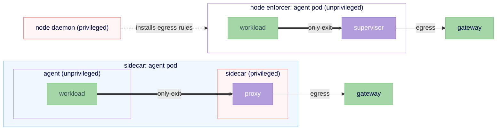

# Topology selection matrix

This is a **lite, draft** decision aid that maps a deployment's starting point to a
recommended isolation topology from [RFC 0012](./README.md). It is supporting
material, not part of the normative RFC. It is seeded from the design meeting that
shaped RFC 0012 and is expected to be refined jointly (target-infrastructure
dimensions, usage personas, and the kata-enablement work) and to eventually
graduate into a docs page: "what are you trying to do, here is the recommended
configuration."

[RFC 0012](./README.md) defines the interface and the design logic (the kernel-sharing
axis, the forbidden cell, sequencing). This file holds the **placement catalog**
(the per-placement detail) and the **selection matrix** (which to choose).

## Placement catalog

The interface offers no single universal placement; different infrastructure and
workloads warrant different ones (istio went the same way). Three near-term
placements, plus two kernel-separated paths behind the same interface. Which share
the agent's kernel, and their build status, is in [RFC 0012's Scope and status
table](./README.md#scope-and-status).

**Today-hardened (fallback).** The supervisor runs in the agent's pod, but non-root. Better hygiene than today, the simplest step, the fallback when no internal isolation exists. Privilege still sits in the pod, so it does not reach `restricted`. (Kata-enablement work can move a sandbox from the `privileged` to the `anyuid` SCC by treating the hypervisor as the boundary, but `anyuid` is a waypoint, not the destination: it still permits root and is not `restricted`.)

**Sidecar proxy (easiest UX).** The proxy runs as a separate container in the **same pod**. Setting up interception still needs `NET_ADMIN`/`NET_RAW` to program iptables, but only the **sidecar** carries it, not the agent container, making the pod spec defensible. Standard pod semantics; agent and sidecar share the pod's kernel. On Kubernetes 1.29+ a native sidecar (an init container with `restartPolicy: Always` and a startup probe) realizes the `boundary_ready` gate, the kubelet holds the agent until the sidecar is ready.

**Node enforcer / daemon-set (no pod privilege).** A privileged per-node daemon does the boundary setup, so the agent pod needs no elevated capabilities. In the prototype, the unprivileged in-pod supervisor's `ensure_boundary` call reaches the daemon, which enters the agent pod's network namespace and installs the egress rules (the registration is the contract call, not a separate protocol). CNI and `NetworkPolicy` are not used: they are static at setup time, and OpenShell must update enforcement on a *running* sandbox as policy changes, so the daemon stays resident. The boundary still funnels egress to the supervisor's proxy; the daemon does the privileged *setup*, it does not replace the proxy. The supervisor stays in the agent pod, sharing the host kernel. Cost: a privileged node component and bespoke node setup.

Two kernel-separated paths behind the same interface:

- **Split-pod.** The supervisor moves to a *separate pod*; the agent pod drops its privileged capabilities and is confined by NetworkPolicy. Standard pod semantics, at the cost of coordinating two scheduled units per sandbox. NetworkPolicy here is a *proof obligation*, not a free win: it requires a policy-enforcing CNI, is default-allow and L3/L4 only, programs eventually-consistently (a pod can egress before the policy lands), and is label-scoped (so it is defense-in-depth unless pod-mutation RBAC is locked down). (A concrete proposal is tracked in #981.)
- **Future node runtime (not stock RuntimeClass).** A stock kata or gVisor RuntimeClass is pod-granular: it puts the supervisor and agent in one guest kernel (the outer-sandbox case, where they stay co-located). Keeping the supervisor *outside* the agent's kernel needs a node runtime built to place them on opposite sides of the boundary. Nobody has built one; it is the seam a kernel-separated backend would fill. Real backend work, off the standard path.

### Capabilities, and how they come off

An unprivileged agent container means shedding the whole seven-capability grant, not just `NET_ADMIN`, and that happens in stages:

- A backend removes `NET_ADMIN` and the network use of `SYS_ADMIN` by moving *network* setup out of the agent's container.
- Removing `SYS_ADMIN` fully needs process and filesystem placement to move too.
- Removing `SYS_PTRACE`/`DAC_READ_SEARCH` needs identity *attested* by the backend instead of read from `/proc`.

A same-pod sidecar moves `NET_ADMIN` out of the agent *container* but not the *pod's* security profile, so the service account still carries the elevation (the friction adopters dislike). Only the node enforcer or split-pod reaches an unprivileged pod. (RFC 0012's Risks section carries the normative requirement that admission reject a daemon-socket mount into the agent container.)

## The dimensions

Two dimensions drive the recommendation, with a third that bumps the posture up a
level rather than forming its own axis.

1. **Infrastructure available (the top-level question).** Do you have nested
   virtualization / kernel isolation (kata, gVisor) on your nodes? This is the
   first thing to decide. If yes, a kernel-grade boundary is on the table. If no,
   you are choosing among namespace-based topologies and trading off sidecar
   versus node placement.
2. **What the agent does.** A privacy-router that only talks to an LLM has a small
   blast radius; an agent that runs arbitrary, never-reviewed code has a large
   one. The industry has no crisp definition of "agent," which is exactly why this
   dimension matters for the recommended posture.
3. **Data sensitivity (the tie-breaker).** Whether PII or other sensitive data is
   in play. Rather than a third axis, treat it as a rule that moves you one cell
   toward stronger isolation within the table below.

## The matrix

Rows are infrastructure; columns are what the agent does. Cells name the
recommended topology from RFC 0012.

| | Agent = privacy-router only (talks to an LLM, low blast radius) | Agent = arbitrary code execution (untrusted code, high blast radius) |
|---|---|---|
| **Has kernel isolation** (nested virt / bare metal; kata or gVisor available) | **Sidecar proxy.** A kernel boundary is overkill for a privacy router; keep it simple. (Move to kata if PII is in play.) | **Kernel-separated.** Put the agent in its own guest kernel, but keep the supervisor *outside* it: split-pod with the agent pod under Kata/gVisor, or a future node runtime. A stock one-pod Kata/gVisor RuntimeClass is not sufficient, it co-locates the supervisor in the same guest kernel. The recommended strong posture. |
| **No kernel isolation** (managed Kubernetes, no nested virt) | **Today-hardened.** Non-root supervisor in the agent pod; the simplest fallback. (Move to sidecar if PII is in play.) | **Sidecar proxy, then node agent.** Sidecar to keep privilege off the agent container; node agent to move privilege off the pod entirely. The best achievable without a VM. |

**PII tie-breaker.** If sensitive data is in play, move one cell toward stronger
isolation: a privacy-router deployment adopts the posture its arbitrary-code
neighbor would use, and an arbitrary-code deployment with kernel isolation
available should prefer the kernel-separated path rather than a same-kernel
sidecar.

## How to read a recommendation

1. Start with infrastructure (the row). No nested virt means the right-hand
   column's strongest option (kernel separation) is simply unavailable; do not
   recommend it.
2. Within the row, pick the column by what the agent does.
3. Apply the PII tie-breaker if relevant.
4. The named topology links back to RFC 0012 for its mechanism, trade-offs, and
   the capabilities it removes.

## Status and ownership

- **Draft, lite.** Deliberately small to keep RFC 0012 reviewable. Expect the
  cells and dimensions to change.
- **Open contributions.** Forthcoming work will propose roughly three target
  infrastructures and the trade-off dimensions, and a set of usage personas; the
  kata-enablement work (the `privileged` to `anyuid` SCC change) informs the
  "has kernel isolation" row. This file is the collection point until it graduates
  to docs.
- **Not normative.** RFC 0012 defines the interface and the topologies. This file
  only recommends which topology to choose; it does not add requirements.
