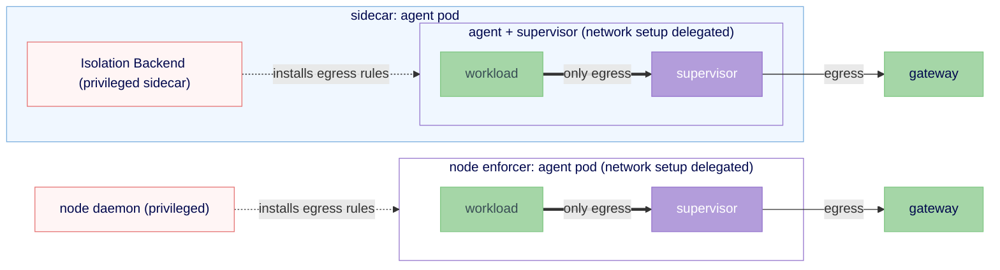

# Topology selection matrix

This non-normative draft maps deployment needs to the placements in
[RFC 0012](./README.md). The RFC defines the contract and kernel-sharing axis;
this file compares placements and suggests when to use them.

## Placement catalog

No placement is universal. The near-term options share the agent's kernel;
stronger options move the supervisor outside it.

**Today-hardened (fallback).** The supervisor remains in the agent pod. This is the simplest path, but isolation privilege remains in the pod and does not meet `restricted`.

**Sidecar-assisted.** A privileged same-pod sidecar programs network interception. The supervisor remains the proxy and applies filesystem and syscall ceilings. This moves only network-setup capabilities out of the agent container; all containers still share one kernel. A Kubernetes [native sidecar](https://kubernetes.io/docs/concepts/workloads/pods/sidecar-containers/) can map `boundary_ready` to a `startupProbe` that gates agent startup, closing the `workspace-init` window on clusters with sidecar containers available (beta since Kubernetes 1.29, GA in 1.33). Moving the supervisor requires a separate design and an agent-side process shim.

**Node enforcer / daemon set.** A privileged node daemon installs routing and rules during `attach`, so the agent pod needs no network-setup capabilities. The in-pod supervisor still runs the proxy and applies process-time ceilings. NetworkPolicy can add L3/L4 defense in depth but cannot replace identity-aware mediation. This placement adds a privileged node component and does not by itself make the pod capability-free or `restricted`-compatible.

Splitting the supervisor into a separate pod is one move; whether it separates kernels depends on the agent pod's RuntimeClass. The two variants land in different containment rows (see [RFC 0012's containment table](./README.md#representative-topologies)).

- **Split-pod, `runc` agent.** Moving the supervisor to another pod separates privilege but not the host kernel. [NetworkPolicy](https://kubernetes.io/docs/concepts/services-networking/network-policies/) requires an enforcing CNI; pods remain non-isolated for egress until selected by an effective egress policy, and enforcement remains L3/L4 and label-scoped. See #981.
- **Split-pod, VM or gVisor agent.** Running only the agent pod under Kata or gVisor places the supervisor outside the agent's guest or application kernel. A one-pod RuntimeClass does not: it co-locates both processes inside that kernel.
- **Future node runtime.** A node runtime could place supervisor and agent on opposite sides of a kernel boundary without a separate supervisor pod. That backend requires its own design.

### The design space, and the one cell stock Kubernetes forbids

Two axes set the space: whether the supervisor shares the agent's kernel, and the pod count or plug point. One combination is impossible on stock Kubernetes.

| | Supervisor shares the agent's kernel (host or guest) | Supervisor in its own kernel, separate from the agent |
|---|---|---|
| One pod | Today-hardened, sidecar-assisted, and the single-pod outer sandbox (gVisor, Kata, or Firecracker). Per-container `securityContext` varies privilege; the proxy mediates within the pod netns. An outer sandbox isolates the host but runs the supervisor inside the agent's isolated kernel (a VM guest under Kata or Firecracker, gVisor's application kernel under gVisor), so it shares that kernel. | **Not expressible on stock Kubernetes.** The runtime that owns the kernel boundary is selected per pod (`runtimeClassName`), not per container, so two containers of one pod cannot have different kernels. |
| Two pods / node runtime | Node enforcer, or a `runc` split-pod: both share the host kernel. | Split-pod with the agent pod under a VM or gVisor `runtimeClassName` (the supervisor stays in its own pod, outside the agent's guest), or a future node runtime that runs the supervisor outside the agent's kernel. |

The forbidden cell follows from Kubernetes [RuntimeClass](https://kubernetes.io/docs/concepts/containers/runtime-class/) and the CRI shape: the kubelet selects one runtime handler for `RunPodSandbox`, then creates containers inside that sandbox. Per-container kernels would need a CRI and runtime change, not another backend. In the right column, procfs and netns operations route through the backend.

### Capabilities, and how they come off

Removing network setup is only the first step toward an unprivileged agent:

- A backend removes `NET_ADMIN` and the network use of `SYS_ADMIN` by moving network setup out of the agent's container.
- Removing `SYS_ADMIN` fully needs process and filesystem placement to move too.
- Removing `SYS_PTRACE`/`DAC_READ_SEARCH` requires identity supplied by the backend instead of read in the agent container.

A sidecar moves network capabilities out of the agent container but not the pod security profile. A node enforcer moves them off the pod. Meeting `restricted` also requires compatible SELinux/MCS labels, seccomp, UID handling, identity, and execution-domain preservation.

## The dimensions

Two dimensions choose a placement; data sensitivity raises the posture:

1. **Infrastructure.** Kernel isolation such as Kata or gVisor enables a kernel-separated placement; otherwise choose among namespace-based options.
2. **Workload.** Arbitrary unreviewed code warrants stronger isolation than a narrow privacy-router workload.
3. **Data sensitivity.** PII or other sensitive data moves the recommendation one step stronger.

## The matrix

Rows are infrastructure; columns are what the agent does. Cells name the
recommended topology from RFC 0012.

| | Agent = privacy-router only (talks to an LLM, low blast radius) | Agent = arbitrary code execution (untrusted code, high blast radius) |
|---|---|---|
| **Has kernel isolation** (nested virt / bare metal; Kata or gVisor available) | **Sidecar-assisted.** A privacy router's blast radius is small, so a kernel boundary's overhead rarely pays for itself against that threat model. (Move to Kata if PII is in play.) | **Kernel-separated.** Put the agent in its own guest kernel, but keep the supervisor outside it: split-pod with the agent pod under Kata/gVisor, or a future node runtime. A one-pod Kata/gVisor RuntimeClass co-locates the supervisor in the same guest kernel. |
| **No kernel isolation** (managed Kubernetes, no nested virt) | **Today-hardened.** Non-root supervisor in the agent pod; the simplest fallback. (Move to sidecar if PII is in play.) | **Sidecar-assisted, then node enforcer.** Sidecar to keep privilege off the agent container; node enforcer to move the network-setup privilege off the pod. The best achievable without a VM. |

**PII tie-breaker.** If sensitive data is in play, move one cell toward stronger
isolation: a privacy-router deployment adopts the posture its arbitrary-code
neighbor would use, and an arbitrary-code deployment with kernel isolation
available should prefer the kernel-separated path rather than a same-kernel
sidecar.

## Status and ownership

This draft is intentionally non-normative. It may evolve into deployment documentation as concrete backends land.
